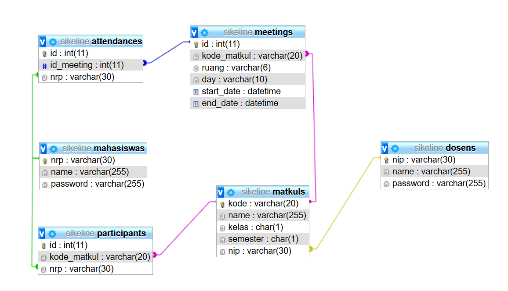
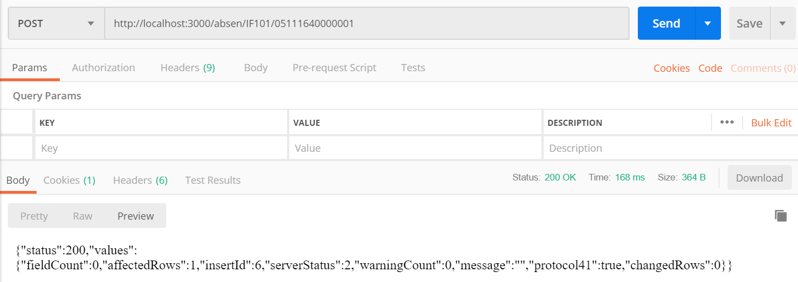
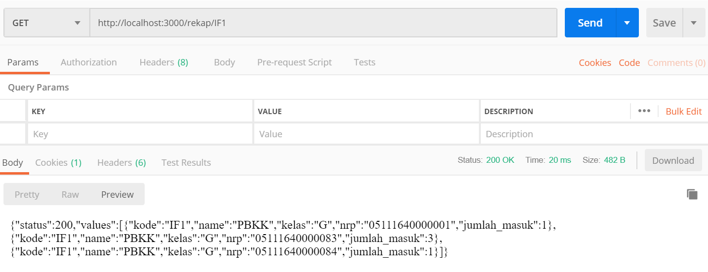
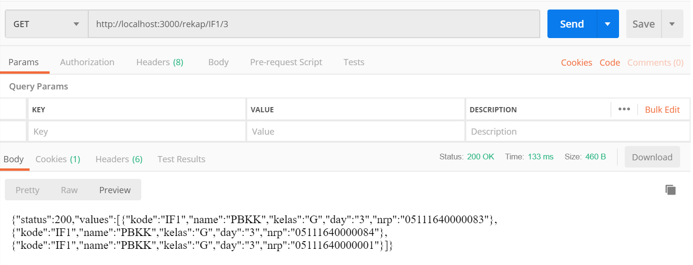
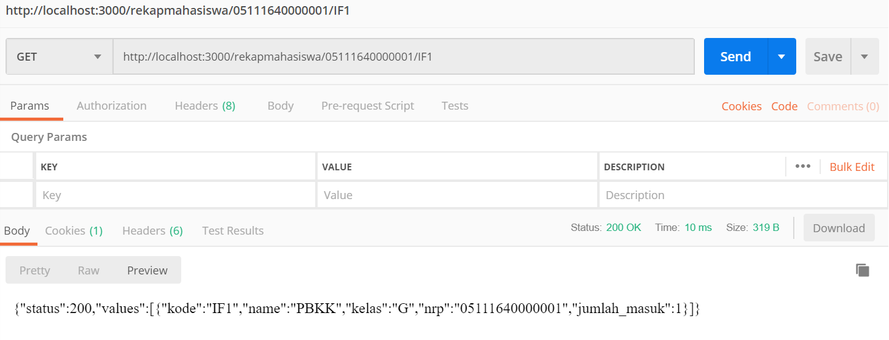
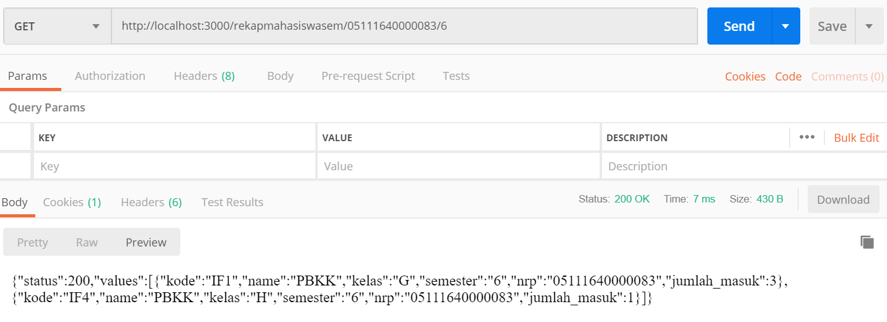
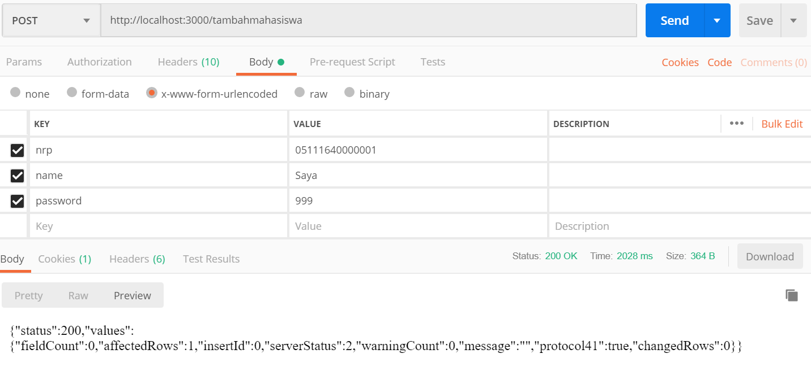
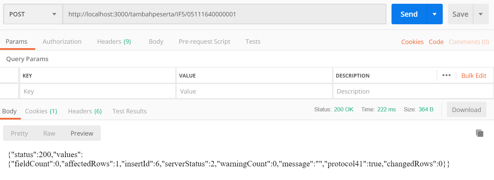
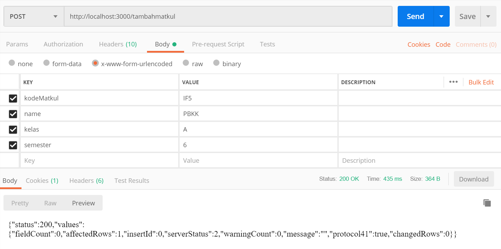
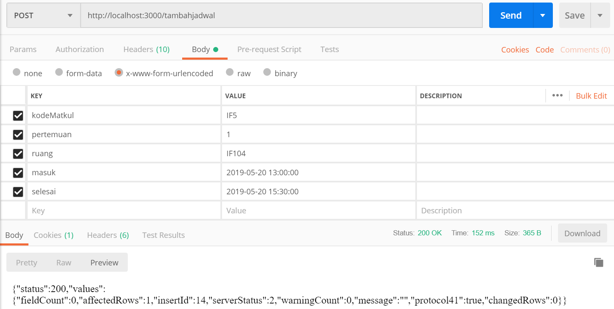

## Framework Based Programming
### Online attendance system API with Node.js, Express.js, & MySql

#### Member:
- Nirmala - 05111540007003
- Ariiq Firanda N - 05111640000083
- Faizal Khilmi Muzakki - 05111640000120

#### Explaining:
- `controller.js`: ur function CRUD to database
- `routes.js` : ur routing
- `conn.js` : database connection configuration
- `res.js` : ur json response formatting

#### Usage:
- `npm install`
- `node database/create_table.js`
- `node server.js`

### Database Schema:
  
   

#### API and Example (Using Postman):
- absen
    - POST /absen/:RUANG/:NRP

    
     
 
- rekap kuliah per semester
    - GET /rekap/:IDMATAKULIAH

    
     

- rekap kuliah per pertemuan
    - GET /rekap/:IDMATAKULIAH/:PERTEMUANKE

    
     

- rekap per mahasiswa per kuliah
    - GET /rekapmahasiswa/:NRP/:IDMATAKULIAH
    
    
     

- rekap per mahasiswa per semester
    - GET /rekapmahasiswa/:NRP/:IDSEMESTER

    
     

- tambah user mhs baru
    - POST /tambahmahasiswa
    - sent via body: nrp, name, password

    
     

- tambah user mhs ke mata kuliah
    - POST /tambahpeserta/:IDMATAKULIAH/:NRP

    
     

- tambah mata kuliah baru
    - POST /tambahmatkul
    - sent via body: kodeMatkul, name, kelas, semester

    
     

- tambah jadwal pertemuan untuk kuliah
    - POST /tambahjadwal
    - sent via body: kodeMatkul, pertemuan, ruang, jam masuk, jam selesai
    
    
     

## Dokumentasi View menggunakan Api Kelompok 5

- Tampilan Awal Sistem Kehadiran Online

.png)

- Tambah Mahasiswa baru
  - Post /vtambahmahasiswa
  - sent via body : NRP, Nama, Password
  - cek mahasiswa yang telah ditambahkan http://7840b93e.ngrok.io/mahasiswa
  
  .png)
  
- Tambah Mata Kuliah 
  - Post /vtambahmatkul
  - sent via body : Mata Kuliah ID, Nama, Semester, Kelas
  - cek mahasiswa yang telah ditambahkan http://7840b93e.ngrok.io/matakuliah
  
  .png)

- Tambah Peserta ke mata kuliah
  - Post /vtambahpeserta
  - sent via body : NRP, Mata Kuliah ID
  
  .png)
  
- Tambah Jadwal Pertemuan untuk Mata Kuliah  
  - Post /vtambahjadwal
  - sent via body : ID Matkul, Pertemuan, Ruangan, Jam Mulai, Jam Selesai
  
  .png)
  
- Absen
  - Post /vabsen
  - sent via body : NRP, Ruangan
  
  .png)

- Rekap Semester
  - Get /vrekapsemester

  .png)

- Rekap Pertemuan
  - Get /vrekappertemuan
  
  .png)

  - Setelah disubmit maka akan muncul rekap pertemuan dari ID mata kuliah dan pertemuan yang telah kita masukkan
  .png)

- Rekap Matakuliah Mahasiswa
  - Get /vrekapmahasiswa
  .png)

  - maka akan tampil rekap dari nrp dan Id mata kuliah tersebut
  .png)

- Rekap Semester Mahasiswa
  - Get /vrekapmahasiswasem
  .png)

  - Maka akan tampil rekap seperti berikut
  .png)
